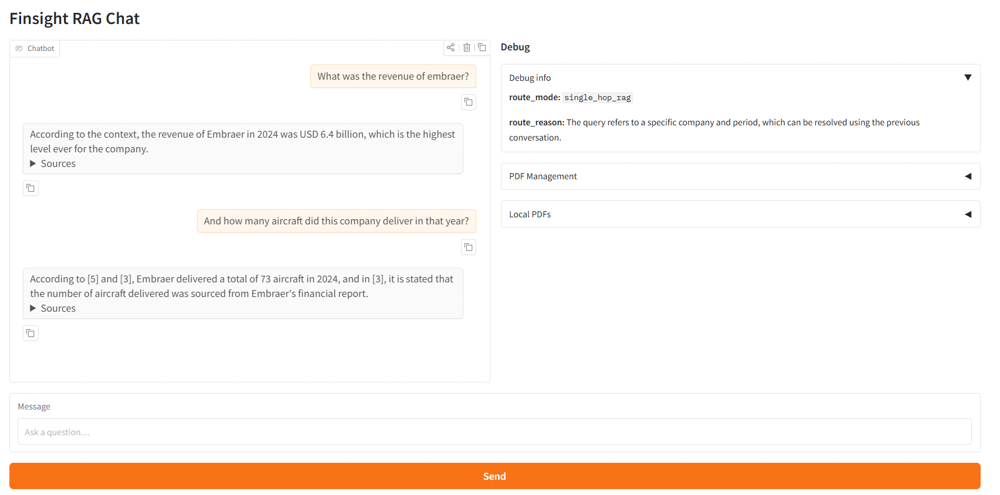
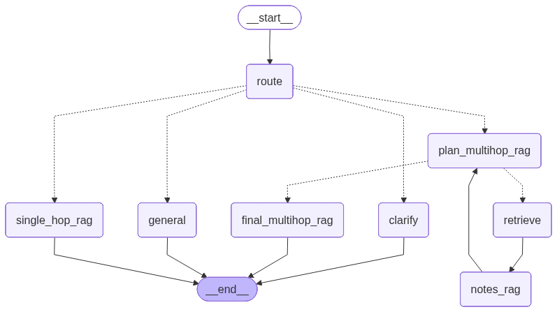

# FinSight RAG

**FinSight RAG** is a Retrieval-Augmented Generation (RAG) application combined with **financial sentiment analysis**, designed to help users analyze and query **financial reports of companies or entities**.
The system leverages **Large Language Models (LLMs)**, **AI agents**, and **domain-specific NLP models** to deliver context-aware, sentiment-driven insights grounded directly in source documents.

Interface localhost link: [Gradio UI](http://localhost:7860)



---

## 🚀 Project Overview

FinSight RAG enables users to:

* Upload and store financial reports (e.g., annual reports, earnings statements)
* Ask natural language questions about the content
* Retrieve relevant document chunks using vector search
* Generate grounded answers using LLMs
* Perform **financial sentiment analysis** on extracted statements
* Interact with the system via a **Gradio-based UI**

The project combines **RAG pipelines**, **agent-based reasoning**, and **fine-tuned financial NLP models** for robust financial analysis.

---

## 🔨 Main Tools

* LangGraph – Agent orchestration  
* LangChain – Retrieval-Augmented Generation (RAG)  
* Hugging Face Transformers – Financial sentiment classification  
* Gradio – Web-based user interface

## 🧠 Core Features

* **Retrieval-Augmented Generation (RAG)**

  * Semantic document retrieval using embeddings
  * Context-aware answer generation
* **Financial Sentiment Analysis**

  * Fine-tuned DistilBERT model on financial text
* **Agent-Based Reasoning**

  * Multi-hop RAG using LangGraph agents

* **Interactive UI**

  * Gradio-powered web interface with chat history
  * Expandable sources below RAG responses
  * Debug panel with route and routing reason

## 🔄 How It Works

The application provides a Gradio chat interface for asking questions about indexed financial reports. The side panel contains additional debug information, including the route selected by the agent and, for multi-hop questions, the hops, subquestions, and notes produced during the process.

The LangGraph agent is implemented in [`finsight_rag/agent/agent.py`](finsight_rag/agent/agent.py). It supports four main routes:

* **Single-hop RAG** – retrieves relevant document chunks and generates an answer.
* **General** – answers conceptual questions without document retrieval.
* **Plan multi-hop RAG** – handles questions that require several retrieval steps.
* **Clarify** – asks for more information when the question cannot be resolved.

In the multi-hop flow, the agent repeatedly plans the next subquestion, retrieves evidence, writes notes from the retrieved documents, and decides whether to continue. Once enough evidence is available, it summarizes the notes into a final answer.



Chat models are tested with Google GenAI and Hugging Face, both accessed through LangChain wrappers. Their construction and configuration are defined in [`finsight_rag/llms/llm_service.py`](finsight_rag/llms/llm_service.py).

The last three user/assistant turns are passed to the chat model, while the retrieved document chunks are provided as additional context. The agent can also call the sentiment analysis model on extracted statements to classify their financial tone.

The RAG service uses **LangChain** for document retrieval and answer generation, with **Chroma** as the persistent vector database. Documents are embedded, stored as searchable chunks, retrieved for each question, and passed to the selected chat model as context.

The application keeps the latest three user/assistant turns as conversational context. Source content is displayed in the interface but is not included in that chat history.

---

## 🏗️ Project Structure

```text
root/
├── .venv/                # Virtual environment
├── .vscode/              # VS Code configuration
├── data/                 # Documents and datasets
├── models/               # Saved and fine-tuned models
├── docs/                 # Architecture and interface images
├── finsight_rag/         # Core application package
│   ├── agent/            # LangGraph agent logic
│   ├── config/           # Configuration files
│   ├── datasets/         # Dataset download scripts
│   ├── ingest/           # Document ingestion
│   ├── llms/             # Functions returning LLM instances
│   ├── logging_config.py  # Loguru console and file logging
│   ├── rag/              # RAG pipelines and retrievers
│   ├── sentiment/        # Sentiment analysis module
│   ├── train/            # Model training scripts
│   ├── app.py            # Application entry point
│   ├── utils.py          # Shared utilities
│   └── tests/            # Unit and integration tests
├── pyproject.toml        # Project dependencies
├── poetry.lock           # Locked dependency versions
└── .gitignore
```

---

## 🧪 Models & Technologies

### 🔍 Embeddings

* **sentence-transformers/all-MiniLM-L6-v2**

Used for:

* Semantic document chunking
* Vector-based retrieval

---

### 📈 Sentiment Analysis Model

* **distilbert-base-uncased**
* Fine-tuned on **Financial PhraseBank**

Purpose:

* Classify sentiment in financial statements
* Capture domain-specific financial tone (positive, neutral, negative)

---

### 💬 Language Models (Chat Models)

The configured chat model is selected in `finsight_rag/config/chat_llm_config.yaml`. The project has been tested with:

* **Google GenAI** models such as **gemini-2.5-flash**
* **Hugging Face** chat models

Used for:

* Answer generation
* Multi-step reasoning
* Agent decision-making

---

### 🧠 AI Agents

* **LangGraph**

  * Orchestrates reasoning steps
  * Coordinates RAG retrieval + sentiment analysis
  * Enables structured, explainable workflows

---

### 🔗 RAG Framework

* **LangChain**

  * Document loaders
  * Chunking & indexing
  * Retrieval pipelines

---

### 🖥️ User Interface

* **Gradio**

  * Simple and interactive UI
  * Chat-style financial analysis interface
  * Expandable source details for retrieved documents

### 📝 Logging

The application uses **Loguru** for console and rotating file logs. Logs include model configuration, agent nodes, route decisions, multi-hop progress, and RAG timings. The default log file is `logs/finsight.log`.

Set a more detailed log level in PowerShell with:

```powershell
$env:FINSIGHT_LOG_LEVEL = "DEBUG"
```

---

## ⚙️ Installation

```bash
git clone https://github.com/your-username/finsight-rag.git
cd finsight-rag
poetry config virtualenvs.in-project true
poetry install
```

---

## ▶️ Running the Application

```bash
poetry run python -m finsight_rag.app
```

Access the UI at `http://localhost:7860`.

---

## 🧪 Training the Sentiment Model

```bash
poetry run python finsight_rag/train/train_sentiment_analyser.py
```

---

## 📚 References

* Financial PhraseBank Dataset
* Hugging Face Transformers
* LangChain
* LangGraph
* Sentence Transformers

---

## 📄 License

This project is licensed under the **MIT License**.

---
